# Kyokai Spec Compiler Traceability

This document is a maintained structural map between the extracted Kyokai specification, inherited Austral compiler evidence, future Kyokai implementation work, and conformance tests. It is not the authority for evidence status. `kyokaiproofstatus.toml` is the ProofTrace registry, and generated `kyokaiproofstatus.md` is the public status projection. If a status here disagrees with ProofTrace or cited executable evidence, this document is stale and must be repaired; it cannot upgrade a claim.

The intended end state is a checked projection generated from spec clause identifiers, compiler boundary identifiers, test families, and ProofTrace records. Until that generator exists, edits to a mapped boundary must update this map and the owning ProofTrace record together.

The Kyokai specification has normative chapter text through D635. A 2026-07-12 clause audit reopened Gate A because routing and chapter presence did not prove that every accepted rule had complete normative clauses. The checked `extraction/pre-d558.toml`, `extraction/d558-d625.toml`, and `extraction/d627-d635.toml` registries now provide D577 clause evidence for the complete accepted boundary, so Gate A is closed through D635. One assembled specification is built from `src/language/`, `src/toolchain/`, `src/stdlib/`, `src/rationale/`, `src/project/`, and the remaining appendices. The project chapters keep governance and evidence visible without turning them into program semantics.

The inherited compiler evidence below is still useful, but it must not be read as proof that the current compiler implements Kyokai. Rows marked `Legacy Verified` describe inherited Austral behavior that was checked against inherited Austral source or tests. A Kyokai row becomes `Verified` only after the extracted Kyokai rule is checked against current Kyokai compiler/source paths and tests.

The Phase 3 source boundary is now a composed Kyokai path: source roles and bytes, Kyokai tokens, a span-carrying surface AST, phase-local structural checks, manifest-rooted source discovery, and derived public/`internal` interface facts. `KyokaiPackageSource` invokes `KyokaiFrontend`; it does not invoke the inherited interface/body parser. These are implementation facts for the Phase 3 scope, not typing, ownership, `.koi`, backend, or conformance claims. The inherited rows below remain migration evidence for later passes.

## Legend

| Status | Meaning |
|--------|---------|
| **Normative Text Present** | The owning chapter contains normative rule text. This status does not satisfy D577 clause-level extraction evidence and cannot close Gate A. |
| **Spec Extracted** | Every live accepted clause has the D577 evidence required for `SPEC_EXTRACTED`. Implementation and conformance remain separate claims. |
| **Kyokai Pending** | A Kyokai implementation/conformance row still needs to be written or checked. |
| **Verified** | Extracted Kyokai claim matches current Kyokai compiler source and tests cited in the row. |
| **Legacy Verified** | Inherited Austral claim matched inherited Austral compiler evidence. Useful migration evidence, not Kyokai implementation status. |
| **Reviewed** | Non-normative or spot-check only; not a line-by-line compiler proof. |
| **Informative** | EBNF, rationale, prose, or migration notes used as explanation only. |
| **N/A** | No compiler evidence is applicable for the row. |
| **Defect** | Source evidence contains an apparent bug or internally inconsistent implementation. |
| **Gap** | Open item: spec, compiler, trace, or tests are incomplete. |

## Current Phase 3 Kyokai frontend evidence

| Spec | Claim | Compiler evidence | Tests | Status |
|------|-------|-------------------|-------|--------|
| D537 / language modules | One handwritten `.kyo` file owns a module; `.kai` and `module body` are retired. | `KyokaiSourceFile`, `KyokaiSurfaceParser`, `KyokaiFrontend`, `KyokaiPackageSource` | source-role, parser, frontend, and package-source host tests; implementation-gated fixtures | Verified |
| D538 / visibility | `public` and `internal` are explicit; an unmarked declaration is private; explicit `private` is rejected. | `KyokaiSurfaceAst`, `KyokaiSurfaceParser`, `KyokaiInterfaceValidation` | parser/interface/frontend host tests and accepted/rejected fixtures | Verified |
| D539 / opacity | `opaque` is accepted only on ordinary record and union definitions, and local interface validation hides their representation. | `KyokaiSurfaceParser`, `KyokaiInterfaceValidation` | parser and interface-validation host tests | Verified |
| D79 / derived interface prefix | Package loading derives public and `internal` declarations and excludes private declarations from the future `.koi` input surface. | `KyokaiFrontend.derived_interface_declarations`, `KyokaiPackageSource` | frontend/package-source host tests and package discovery fixture | Verified |

`Verified` here is limited to the cited Phase 3 rule and implementation path. It does not claim cross-module resolution, `.koi` serialization or consumption, typing, ownership checking, released diagnostic identities, or conformance-backed execution.

Columns: **Spec** | **Claim (summary)** | **Compiler evidence** | **Tests** | **Status**

## Current Kyokai build chapter order

`Makefile` now builds the extracted Kyokai specification in this order:

1. [spec.md](spec.md)
2. [src/language/00-introduction.md](src/language/00-introduction.md)
3. [src/language/01-goals-and-non-goals.md](src/language/01-goals-and-non-goals.md)
4. [src/language/02-lexical-syntax.md](src/language/02-lexical-syntax.md)
5. [src/language/03-grammar.md](src/language/03-grammar.md)
6. [src/language/04-modules-and-visibility.md](src/language/04-modules-and-visibility.md)
7. [src/language/05-declarations.md](src/language/05-declarations.md)
8. [src/language/06-type-system.md](src/language/06-type-system.md)
9. [src/language/07-generics-and-typeclasses.md](src/language/07-generics-and-typeclasses.md)
10. [src/language/08-patterns.md](src/language/08-patterns.md)
11. [src/language/09-expressions-and-evaluation.md](src/language/09-expressions-and-evaluation.md)
12. [src/language/10-statements-and-control-flow.md](src/language/10-statements-and-control-flow.md)
13. [src/language/11-linearity-borrowing-and-regions.md](src/language/11-linearity-borrowing-and-regions.md)
14. [src/language/12-implicit-completions-and-elaboration.md](src/language/12-implicit-completions-and-elaboration.md)
15. [src/language/13-contracts-and-runtime-failure.md](src/language/13-contracts-and-runtime-failure.md)
16. [src/language/14-capabilities-and-authority.md](src/language/14-capabilities-and-authority.md)
17. [src/language/15-concurrency.md](src/language/15-concurrency.md)
18. [src/language/16-unsafe-ffi-and-abi.md](src/language/16-unsafe-ffi-and-abi.md)
19. [src/language/17-memory-layout-and-backend-contract.md](src/language/17-memory-layout-and-backend-contract.md)
20. [src/language/18-built-ins.md](src/language/18-built-ins.md)
21. [src/language/19-examples.md](src/language/19-examples.md)
22. [src/toolchain/00-toolchain-overview.md](src/toolchain/00-toolchain-overview.md)
23. [src/toolchain/01-manifest-package-workspace.md](src/toolchain/01-manifest-package-workspace.md)
24. [src/toolchain/02-module-resolution-and-koi.md](src/toolchain/02-module-resolution-and-koi.md)
25. [src/toolchain/03-cli.md](src/toolchain/03-cli.md)
26. [src/toolchain/04-build-profiles-targets-linking.md](src/toolchain/04-build-profiles-targets-linking.md)
27. [src/toolchain/05-diagnostics.md](src/toolchain/05-diagnostics.md)
28. [src/toolchain/06-formatter.md](src/toolchain/06-formatter.md)
29. [src/toolchain/07-testing-coverage-bench.md](src/toolchain/07-testing-coverage-bench.md)
30. [src/toolchain/08-docs-lsp-audit.md](src/toolchain/08-docs-lsp-audit.md)
31. [src/toolchain/09-reproducibility-incremental-builds.md](src/toolchain/09-reproducibility-incremental-builds.md)
32. [src/toolchain/10-package-index-semver-releases-ci.md](src/toolchain/10-package-index-semver-releases-ci.md)
33. [src/toolchain/11-build-generation-and-playground.md](src/toolchain/11-build-generation-and-playground.md)
34. [src/toolchain/12-capability-deny-policy.md](src/toolchain/12-capability-deny-policy.md)
35. [src/toolchain/13-application-integration-and-deployment.md](src/toolchain/13-application-integration-and-deployment.md)
36. [src/stdlib/00-stdlib-overview.md](src/stdlib/00-stdlib-overview.md)
37. [src/stdlib/01-admission-contracts.md](src/stdlib/01-admission-contracts.md)
38. [src/stdlib/02-core-result-optional-display-error.md](src/stdlib/02-core-result-optional-display-error.md)
39. [src/stdlib/03-allocators-and-memory-containers.md](src/stdlib/03-allocators-and-memory-containers.md)
40. [src/stdlib/04-text-bytes-paths-and-strings.md](src/stdlib/04-text-bytes-paths-and-strings.md)
41. [src/stdlib/05-collections.md](src/stdlib/05-collections.md)
42. [src/stdlib/06-iterators-and-generators.md](src/stdlib/06-iterators-and-generators.md)
43. [src/stdlib/07-math-and-numerics.md](src/stdlib/07-math-and-numerics.md)
44. [src/stdlib/08-io-files-env-process-time-random.md](src/stdlib/08-io-files-env-process-time-random.md)
45. [src/stdlib/09-concurrency-primitives.md](src/stdlib/09-concurrency-primitives.md)
46. [src/stdlib/10-crypto-policy.md](src/stdlib/10-crypto-policy.md)
47. [src/stdlib/11-transitional-ffi-tracking.md](src/stdlib/11-transitional-ffi-tracking.md)
48. [src/stdlib/12-application-integration-contracts.md](src/stdlib/12-application-integration-contracts.md)
49. [src/rationale/00-rationale-index.md](src/rationale/00-rationale-index.md)
50. [src/rationale/01-language-design.md](src/rationale/01-language-design.md)
51. [src/rationale/02-syntax.md](src/rationale/02-syntax.md)
52. [src/rationale/03-error-handling-and-tpoe.md](src/rationale/03-error-handling-and-tpoe.md)
53. [src/rationale/04-linear-resources.md](src/rationale/04-linear-resources.md)
54. [src/rationale/05-capabilities.md](src/rationale/05-capabilities.md)
55. [src/rationale/06-concurrency.md](src/rationale/06-concurrency.md)
56. [src/rationale/07-stdlib-philosophy.md](src/rationale/07-stdlib-philosophy.md)
57. [src/rationale/08-toolchain-philosophy.md](src/rationale/08-toolchain-philosophy.md)
58. [src/rationale/09-backend-choice.md](src/rationale/09-backend-choice.md)
59. [src/project/00-project-boundary.md](src/project/00-project-boundary.md)
60. [src/project/01-governance.md](src/project/01-governance.md)
61. [src/project/02-decision-traceability.md](src/project/02-decision-traceability.md)
62. [src/project/03-formalization-roadmap.md](src/project/03-formalization-roadmap.md)
63. [src/project/04-project-licensing.md](src/project/04-project-licensing.md)
64. [src/project/05-admission-and-change-control.md](src/project/05-admission-and-change-control.md)
65. [src/project/06-reference-products-and-workloads.md](src/project/06-reference-products-and-workloads.md)
66. [src/appendices/c-austral-differences.md](src/appendices/c-austral-differences.md)
67. [src/appendix-a.md](src/appendix-a.md)

## Current Kyokai extraction summary

| Spec Family | Current Spec Locations | Compiler Evidence | Tests | Status |
| --- | --- | --- | --- | --- |
| Language specification | `src/language/00-introduction.md` through `src/language/19-examples.md` | Inherited Austral compiler still needs rule-by-rule Kyokai audit. | Accepted clauses through D635 are checked; executable conformance remains open. | Normative Text Present |
| Toolchain specification | `src/toolchain/00-toolchain-overview.md` through `src/toolchain/13-application-integration-and-deployment.md` | Current inherited CLI/build behavior is not yet a Kyokai toolchain implementation claim. | D558-D625 clauses are checked where routed here; command, manifest, artifact, diagnostic, formatter, docs, analysis, release, and conformance implementation remains planned. | Normative Text Present |
| Standard-library contract specification | `src/stdlib/00-stdlib-overview.md` through `src/stdlib/12-application-integration-contracts.md` | Inherited Austral stdlib is reference evidence only; Kyokai `Kyokai.*` APIs still need admission and implementation. | D558-D625 clauses are checked where routed here; stdlib admission, edge-case, property/fuzz, oracle/vector, platform, and integration evidence remains planned. | Normative Text Present |
| Rationale | `src/rationale/00-rationale-index.md` through `src/rationale/09-backend-choice.md` | Compiler evidence not applicable except where rationale points to normative chapters. | N/A. | Reviewed |
| Official-project contract and evidence | `src/project/00-project-boundary.md` through `src/project/06-reference-products-and-workloads.md` | Governance, traceability, formalization, licensing, admission, and workload records; not compiler semantics. | D577 registry/checker covers the accepted boundary through D635; recurring records and operational evidence remain. | Normative Text Present |
| Austral source material and GFDL text | Old inherited chapter files were replaced by Kyokai chapters; `src/appendix-a.md` carries the full GFDL text. | Source provenance is recorded in `src/project/04-project-licensing.md` and `src/appendices/c-austral-differences.md`. | Informative |

## Post-D557 and D558-D625 normative integration map

The accepted D396-D625 surface is integrated into normative chapters by behavior family. This table records the rewritten homes so later implementation and conformance work can cite the actual contract instead of an appended decision cluster. It is a routing aid and cannot promote a D-point by itself. The checked D558-D625 registry and generated review provide that batch's separate D577 evidence.

| Behavior family | Integrated spec homes | Extracted mechanics |
| --- | --- | --- |
| CLI, reporting, cache, and cleanup | `src/toolchain/03-cli.md`, `src/toolchain/09-reproducibility-incremental-builds.md` | Versioned human/JSON lanes, prompt and network rules, cache identities, repair, corruption handling, `kyokai clean`, `--outputs`, `--all`, `clean docs`, and separately scoped `--global` cleanup. |
| Capability deny policy | `src/toolchain/12-capability-deny-policy.md`, `src/toolchain/03-cli.md`, `src/toolchain/01-manifest-package-workspace.md`, `src/toolchain/08-docs-lsp-audit.md`, `src/toolchain/09-reproducibility-incremental-builds.md`, `src/language/14-capabilities-and-authority.md` | Deny-only authority policy from toolchain defaults, user/global config, manifests, and `--deny-capability`; strictest policy wins, denied package/target/generator/test/docs/audit/publish/execution requirements fail with diagnostics, and no policy grants or changes source-level capabilities. |
| Packages, lockfiles, and KBI | `src/toolchain/01-manifest-package-workspace.md`, `src/toolchain/02-module-resolution-and-koi.md` | Feature-set package instances, source hashes, lockfile modes, offline resolution, runnable targets, KBI schema, edition boundaries, compressed transport, and shared KBI reader rules. |
| Analysis Server, docs, and audit | `src/toolchain/05-diagnostics.md`, `src/toolchain/08-docs-lsp-audit.md`, `src/toolchain/10-package-index-semver-releases-ci.md` | Stable diagnostic lifecycle, fix safety classes, no separate lint command, Analysis Server lanes, editor bundles, package-root committed `kdocs/`, compact docs-index projections, verified raw-file retrieval, docs cache, audit categories, SemVer domains, advisories, and release verification. |
| Build generation and artifact emission | `src/toolchain/04-build-profiles-targets-linking.md`, `src/toolchain/11-build-generation-and-playground.md`, `src/language/17-memory-layout-and-backend-contract.md`, `src/rationale/09-backend-choice.md` | One generated-C emission path, admitted C-toolchain discovery, target records, strict float policy, CPU dispatch, requested `c_output/`, source maps, generator sandbox records, generation drift checks, bindgen wrapper kits, standalone compiler inputs, and development-service boundaries. |
| Linear ownership ergonomics | `src/language/05-declarations.md`, `src/language/11-linearity-borrowing-and-regions.md`, `src/stdlib/03-allocators-and-memory-containers.md`, `src/stdlib/05-collections.md`, `src/stdlib/06-iterators-and-generators.md` | Validated wrappers, parameter roles, `build` expressions, the closed D348 ownership-state set, cleanup reservations layered over ownership state, read-only access, reborrow joins, graph owners, generational handles, hole-free extraction, drain finalization, early release diagnostics, and named recovery payloads. |
| Implicit completions and elaboration | `src/language/12-implicit-completions-and-elaboration.md` | Closed per-entry registry IDs, local static contexts, inserted nodes, evidence obligations, stable diagnostic labels, `.koi` recording rules, spec homes, forbidden effects, and checker-visible lowering. |
| Conditional instances and materialization | `src/language/07-generics-and-typeclasses.md` | Explicit conditional instances, selected-graph coherence, overlap witnesses, unsafe-origin instance audit, and semantics-preserving code-size controls. |
| Concurrency and protocol composition | `src/language/15-concurrency.md`, `src/stdlib/09-concurrency-primitives.md`, `src/stdlib/08-io-files-env-process-time-random.md` | SPSC-only Tier-1 channels, explicit brokers, backpressure, fair `RwLock`, closed spawn-shareable registry, callback classes, poller adapter state, deadlines, cancellation, TLS snapshots, and partial I/O progress. |
| Failure and fatal reporting | `src/language/13-contracts-and-runtime-failure.md`, `src/toolchain/07-testing-coverage-bench.md` | Recoverable mutation classes, named recovery records, panic-during-defer escalation, redacted local fatal reports, freestanding fatal consequences, linear fixtures, and allocation-failure testing. |
| Text, bytes, paths, and static literals | `src/language/02-lexical-syntax.md`, `src/language/18-built-ins.md`, `src/stdlib/04-text-bytes-paths-and-strings.md`, `src/stdlib/05-collections.md` | Plain escaped, raw multiline, and explicit `static "..."` literals produce non-allocating `StaticString`; `literal.toStringIn(allocator)` creates owned strings; `TextView[R]` is the region-bound immutable borrowed UTF-8 view; bytes, C strings, OS strings, paths, Unicode-versioned algorithms, and borrowed text-key lifetimes remain explicit. |
| Structured codecs | `src/stdlib/04-text-bytes-paths-and-strings.md`, `src/stdlib/01-admission-contracts.md`, `src/toolchain/11-build-generation-and-playground.md` | Named strict/permissive/streaming/canonical profiles, explicit allocators and `CodecBudget`, duplicate-key and numeric policy, streaming recovery state, unknown-field behavior, canonical output, schema metadata, generator provenance, and corpus/fuzz/limit tests. |
| Numeric admission | `src/stdlib/07-math-and-numerics.md`, `src/language/18-built-ins.md` | Checked arithmetic families, CPU feature facts, stable numeric admission records, independent oracles, vectors, target caveats, and transitional-wrapper evidence. |
| Application/framework contracts | `src/stdlib/12-application-integration-contracts.md`, `src/language/16-unsafe-ffi-and-abi.md`, `src/toolchain/08-docs-lsp-audit.md` | Owner-qualified handles, scoped views, heterogeneous unions/registries/opaque boundaries, existing callback classes, deterministic fakes, and integration admission rules. |
| Runtime datasets and application domains | `src/stdlib/12-application-integration-contracts.md`, `src/stdlib/04-text-bytes-paths-and-strings.md`, `src/stdlib/08-io-files-env-process-time-random.md`, `src/stdlib/10-crypto-policy.md` | Dataset provider identity and update authority plus browser, server, CLI/TUI, native, mobile, embedded, GPU/ML, numerical, and data ownership contracts. |
| Migration, adapters, packaging, and deployment | `src/toolchain/13-application-integration-and-deployment.md`, `src/toolchain/03-cli.md`, `src/toolchain/05-diagnostics.md`, `src/toolchain/10-package-index-semver-releases-ci.md`, `src/toolchain/11-build-generation-and-playground.md`, `src/toolchain/12-capability-deny-policy.md` | Generated-API projection, preview-first edition migration, least-authority explanation, typed foreign adapters, packaging/signing plans, browser/mobile build lanes, explicit dataset updates, OCI/Kubernetes/serverless/Nix deployment plans, and plan/apply authority separation. |

The workflow and infrastructure-only D-points remain tracked in `PROJECT_STANDARDS.md`, `docs/contributing/spec-writing.md`, and `docs/infrastructure/services.md`. They do not invent language semantics.

## Current inherited compiler pipeline evidence

The inherited pipeline below is useful evidence for Kyokai compiler planning. Paths should be checked against the current Kyokai `../lib/` tree during extraction:

```mermaid
flowchart LR
  parseCombine[parse_and_combine]
  return0[check_ends_in_return]
  desugar[DesugaringPass.desugar]
  extract[ExtractionPass.extract]
  augment[TypingPass.augment_module]
  linear[LinearityCheck.check_module_linearity]
  bodies[BodyExtractionPass.extract_bodies]
  mono[Monomorphize.monomorphize]
  codegen[CodeGen.gen_module]
  render[CRenderer.render_unit]
  parseCombine --> return0 --> desugar --> extract --> augment --> linear --> bodies --> mono --> codegen --> render
```

(`parse_and_combine` in [`Compiler.ml`](../lib/Compiler.ml) is the inherited path: it parses an interface/body pair, appends pervasive imports, and runs `CombiningPass.combine`. D537 requires this path to be replaced for Kyokai source.)

## Phase 1 - Lexer / parser / CST

| Spec | Claim | Compiler evidence | Tests | Status |
|------|--------|---------------------|-------|--------|
| inherited 2.syntax section modules | Inherited module interface ends `end module.`; inherited body ends `end module body.` | `Parser.mly`: `module_int` / `module_body` (`END MODULE PERIOD`, `END MODULE BODY PERIOD`) | Parser tests | Legacy Verified |
| 2.syntax section comments | Line comments `--` ... newline or EOF | `Lexer.mll`: `comment` rule | - | Legacy Verified |
| 2.syntax section literals | Decimal / hex `#x` / bin `#b` / oct `#o`; `'` digit separators; float `E`/`e` | `Lexer.mll`: `dec_constant`, `hex_constant`, ...; `Parser.mly`: `int_constant` / `float_constant` | `ExpressionParserTest.ml` | Legacy Verified |
| 2.syntax section literals | String / triple-string; char escapes limited | `Lexer.mll`: `read_string`, `read_triple_string`, `char_constant` | - | Legacy Verified |
| 2.syntax section imports | Empty import lists parse | `Parser.mly`: `separated_list(COMMA, imported_symbol)` in `import_stmt` | - | Legacy Verified |
| 2.syntax section functions | Empty function body parses as empty block | `Parser.mly`: `function_def` uses `body=block?` | FFI examples | Legacy Verified |
| inherited 2.syntax section module body | Inherited module-level pragmas appear before imports and `module body` | `Parser.mly`: `docstringopt pragmas=pragma* imports=import_stmt* MODULE BODY` | `test-programs/*` unsafe modules | Legacy Verified |
| 2.syntax EBNF | Not every production maps 1:1 to Menhir | Informative abstraction | - | Informative |

### Phase 1 detail: docstrings

| Spec | Claim | Compiler evidence | Status |
|------|--------|---------------------|--------|
| 2.syntax section comments | Docstrings are `TRIPLE_STRING_CONSTANT` at module head | `Parser.mly`: `module_int` / `module_body` use `docstringopt`; `Lexer.mll` triple-string | Legacy Verified |
| 5-7 syntax | Keywords, `=>` named args, `@embed`, `sizeof(T)` | `Lexer.mll` tokens; `Parser.mly` `named_arg`, `intrinsic`, `SIZEOF` | `StatementParserTest.ml`, `ExpressionParserTest.ml` | Legacy Verified |
| 6.statements | `else if` tokenization | `Lexer.mll`: `ELSE_IF` from `"else" whitespace+ "if"` | - | Legacy Verified |
| 6.statements | `var { ... } := expr;` destructure accepted | `Parser.mly`: `let_destructure` uses `var_mutability` | - | Legacy Verified |
| 6.statements | `for` loop bounds are Index-compatible and emitted as inclusive `<=` | `TypingPass.ml`: `is_compatible_with_index_type`; `CodeGen.ml` / `CRenderer.ml`: `CFor` | `001-trivial/004-for-loop` | Legacy Verified |
| 7.expressions | `@embed(ty, "fmt", ...)` | `Parser.mly`: `intrinsic` | - | Legacy Verified |

## Phase 2 - Types, typeclasses, builtins

| Spec | Claim | Compiler evidence | Tests | Status |
|------|--------|---------------------|-------|--------|
| 4.types | Built-in scalars `Nat*` / `Int*` / `Index` / `ByteSize` / floats | `TypeParser.ml`: `parse_built_in_type` | Type tests | Legacy Verified |
| 4.types | `Static` region; string type `Span[Nat8, Static]` | `TypeParser.ml` `Static`; `Type.ml` `string_type`; `TastUtil.ml` `TStringConstant` | - | Legacy Verified |
| 4.types | Borrow `&[T,R]`, span `Span[T,R]` not nominal Reference | `Parser.mly` `typespec`; `TypeParser.ml` `QReadRef` / `QSpan` | - | Legacy Verified |
| 4.types | Universe markers `Free`/`Linear`/`Type`/`Region` | `Parser.mly` `universe`; `Type.ml` `universe` | - | Legacy Verified |
| 4a | Instance orphan / overlap / shape rules | `TypeClasses.ml` (`check_instance_orphan_rules`, `overlapping_instances`, `check_instance_argument_has_right_shape`, ...) | - | Legacy Verified |
| 7b | Pervasive imports injected into every non-pervasive module | `BuiltIn.ml` `pervasive_imports`; `Compiler.ml` `append_import_to_interface` / `append_import_to_body` | - | Legacy Verified |
| 7c | `Austral.Memory` API signatures | `builtin/Memory.aui` | `test-programs/suites/016-*`, `017-*` | Legacy Verified |
| 7c | `Austral.Memory` runtime bodies: zero-count allocation abort, direct null return on allocator failure, span length `(final - start) + 1` | `builtin/Memory.aum`; `prelude.c` `au_calloc` / `au_realloc` | `test-programs/suites/016-*`, `017-*` | Legacy Verified |
| 7d | `Austral.Pervasive` API | `builtin/Pervasive.aui` / `Pervasive.aum` | `test-programs/suites/008-*` | Legacy Verified |
| 7d | `Remainder` method `rem` | `Pervasive.aui` | - | Legacy Verified |
| 7d | Duplicate malformed `instance Remainder(Nat8)` body exists before `instance Remainder(Int8)` | `builtin/Pervasive.aum` around Remainder instances | - | Defect |

## Phase 3 - Typechecking (expressions + statements)

| Spec | Claim | Compiler evidence | Tests | Status |
|------|--------|---------------------|-------|--------|
| 7.expressions | Integer literal default type `Int32` | `TastUtil.ml` `get_type` `TIntConstant` -> `Integer (Signed, Width32)` | - | Legacy Verified |
| 7.expressions | `sizeof(T)` type `ByteSize` | `TastUtil.ml` `TSizeOf` -> `WidthByteSize` | - | Legacy Verified |
| 7.expressions | Casts: literals, write->read ref, polymorphic return, general match | `TypeCheckExpr.ml` `augment_typecast` | - | Legacy Verified |
| 7.expressions | Arithmetic lowers via pervasive trapping ops; accepted numeric type also needs visible `TrappingArithmetic` resolution (`Float32` has no shipped instance) | `TypeCheckExpr.ml` `augment_arithmetic`; `builtin/Pervasive.aui` instances | - | Legacy Verified |
| 7.expressions | Comparisons currently enforce operand type matching but do not call `TypeSystem.is_comparable` | `TypeCheckExpr.ml` `augment_comparison`; unused helper in `TypeSystem.ml` | - | Legacy Verified |
| 6 / 7 | `Foreign_Import` only in `UnsafeModule` | `TypingPass.ml` `augment_decl` / `foreign_in_safe_module` | - | Legacy Verified |
| 7e | `Foreign_Export` does not use the same unsafe-module guard in typing | `TypingPass.ml` `augment_decl` `[ForeignExportPragma _]` branch | `010-functions/004-export-function` | Legacy Verified |
| 3.modules | `Austral.Memory` import forbidden in safe module | `ImportResolution.ml` `import_memory_in_safe_module` | - | Legacy Verified |

## Phase 4 - Linearity + borrows

| Spec | Claim | Compiler evidence | Tests | Status |
|------|--------|---------------------|-------|--------|
| 7a | Linear variable use rules | `LinearityCheck.ml` | `test-programs/suites/007-*`, `015-*` | Legacy Verified |
| 6 / 7 borrow | Borrow statement / desugar; read borrows accepted for free and linear variables; mutable local borrow rejected for immutable locals | `DesugarBorrows.ml`; `Parser.mly` `borrow_stmt`; `TypingPass.ml` `ABorrow` | `007-borrowing/*`, `016-borrow-free` | Legacy Verified |

## Phase 5 - Modules, entrypoint, FFI, C ABI

| Spec | Claim | Compiler evidence | Tests | Status |
|------|--------|---------------------|-------|--------|
| 3.modules | Import syntax; pervasive imports injected at combine | `Parser.mly` `import_stmt`; `Compiler.ml` `append_import_*` + `BuiltIn.ml` | - | Legacy Verified |
| 8.examples | Entrypoint `main` public; 0 or 1 `RootCapability` | `Entrypoint.ml` `check_entrypoint_validity` | Examples in spec | Legacy Verified |
| 7e | Pragmas `Foreign_Import` / `Foreign_Export` / `Unsafe_Module`; exact `External_Name` named argument shape | `CstUtil.ml` `make_pragma` | - | Legacy Verified |
| 7f import | Lowering to `au_*` / `size_t` / spans | `CodeGen.ml` -> `CRepr.ml` / `CRenderer.ml` (C emission path) | `CRendererTest.ml` (where applicable) | Legacy Verified |
| 7f export | Allowed / disallowed export types | `ExportInstantiation.ml` `transform_ty` (rejects `Unit`, refs, spans, `Pointer`, `NamedType`, ...) | - | Legacy Verified |

## Phase 6 - Non-normative chapters

| Spec | Claim | Compiler evidence | Tests | Status |
|------|--------|---------------------|-------|--------|
| 0, 1, 9 | Design goals / style: no compiler cross-check required for normative truth | - | - | Reviewed |
| rationale/* | Mostly motivation; pseudocode flagged in 3.resource-types; `austral` fenced code blocks only in 4.capabilities (module sketches) | Manual review | - | Reviewed |
| appendix-a | GFDL text | N/A | - | N/A |
| 8.examples | Examples pair interface+body where `main` is entry | `Entrypoint.ml` | - | Legacy Verified |

## Phase 7 - upstream Austral `lib/*.ml` ownership checklist

Each file is assigned to a **phase** for coverage closure (helpers are **N/A** unless the spec names them).

| File | Owner phase | Spec touchpoints | Status |
|------|-------------|------------------|--------|
| Lexer.mll | 1 | 2.syntax | Legacy Verified |
| Parser.mly | 1 | 2-7 surface | Legacy Verified |
| ParserInterface.ml | 1 | - | N/A |
| Cst.ml, CstUtil.ml | 1,5 | CST + pragmas | Legacy Verified |
| Type.ml, TypeParser.ml, TypeSystem.ml, TypeMatch.ml, TypeSignature.ml, TypeReplace.ml, TypeStripping.ml, TypeBindings.ml, TypeVarSet.ml, TypeParameter.ml, TypeParameters.ml, TypeErrors.ml | 2 | 4.types, 4a | Legacy Verified |
| Names.ml, Qualifier.ml, Region.ml, RegionMap.ml | 2 | Regions, pretty-print names | Legacy Verified |
| BuiltIn.ml, BuiltIn.mli, BuiltInModules.mli | 2 | 7b-7d | Legacy Verified |
| Env.ml, EnvTypes.ml, EnvUtils.ml, EnvExtras.ml, LexEnv.ml | 2,4,5 | Env / instances | Legacy Verified |
| ImportResolution.ml, Imports.ml | 5 | 3.modules | Legacy Verified |
| CombiningPass.ml, DesugaringPass.ml, DesugarBorrows.ml, DesugarPaths.ml | 1,4 | combine, desugar | Legacy Verified |
| ExtractionPass.ml, BodyExtractionPass.ml, AbstractionPass.ml | 5 | linking | Legacy Verified |
| TypingPass.ml, TypeCheckExpr.ml, TastUtil.ml | 3 | 6,7 | Legacy Verified |
| ReturnCheck.ml | 3 | `check_ends_in_return` | Legacy Verified |
| LinearityCheck.ml | 4 | 7a | Legacy Verified |
| TypeClasses.ml | 2 | 4a | Legacy Verified |
| Monomorphize.ml, MonoType.ml, MonoTypeBindings.ml, MtastUtil.ml | 7 | monomorphize (spec defers codegen detail) | N/A |
| CodeGen.ml, CRepr.ml, CRenderer.ml | 5 | 7f | Legacy Verified |
| ExportInstantiation.ml | 5 | 7f export table | Legacy Verified |
| Entrypoint.ml | 5 | 8.examples, entrypoint | Legacy Verified |
| Compiler.ml | 0 | pipeline | Legacy Verified |
| Stages.ml, Id.ml, Identifier*.ml, Span.ml, SourceContext.ml, Reporter.ml, Error*.ml, Escape.ml, Util.ml, StringSet.ml, ModIdSet.ml, ModuleNameSet.ml, DeclIdSet.ml, Common.ml, Version.ml, HtmlError.ml | mixed | Support / errors | N/A |
| Cli*.ml | CLI | Out of core spec | N/A |
| LiftControlPass.ml | 4 | Control lowering (spec does not detail) | N/A |

## Phase 8 - Legacy convergence / CI

- Run `dune build` / `dune runtest` in a separate upstream Austral checkout when OCaml deps (`yojson`, `ounit2`, etc.) are available and its `lib/dune` lists `builtInModules` under `modules_without_implementation` if required by the toolchain.
- **Last verification attempt:** `dune runtest` failed: missing `ounit2`, missing `yojson` for `austral_core`, and Menhir stanza reports `builtInModules` without implementation - fix local opam/switch before treating CI as green.
- **Installed compiler E2E verification:** `AUSTRAL=austral python3 test-programs/runner.py` in a separate upstream Austral checkout passed every upstream end-to-end test.
- **Spec fence verification:** `make check-austral-fences AUSTRAL=austral` passed: 14 complete Austral fences compiled; 101 fragment fences skipped by design.
- **Spec build verification:** `nix-shell -p pandoc texliveSmall --run 'make'` passed and generated `spec.pdf` plus `spec.html`.
- After any Kyokai implementation or conformance edit, update Kyokai rows from **Kyokai Pending** or **Gap** to **Verified** only with a cited current Kyokai source/test path. Do not upgrade `Legacy Verified` rows merely because inherited Austral tests pass.

## Mirror: `austral.github.io/_spec/`

Optional sibling site: replay the same **Phase 1-5** rows against `_spec/*.md`. As of this trace creation, `types.md` / `linearity.md` / `goals.md` / `rationale-capabilities.md` / `austral-memory.md` / `austral-pervasive.md` / `expressions.md` / `statements.md` were aligned with the same compiler anchors.

## Open implementation and conformance gaps after extraction

1. **Kyokai compiler audit**: inherited Austral compiler evidence must be replayed against the extracted Kyokai language chapters before any row becomes `Verified`.
2. **Kyokai conformance suites**: parser, checker, linearity, capability, unsafe/FFI, generated-C/C-toolchain, toolchain, and stdlib tests still need paths and status rows.
3. **Stdlib admission records**: `Kyokai.*` modules need implementation paths, admission records, edge-case tests, oracle/vector tests where relevant, and transitional FFI records.
4. **Toolchain behavior**: `kyokai` CLI, package manager, `.koi`, formatter, docs, LSP, audit, build output/cache layout, and release commands need implementation evidence and tests.
5. **Formal proof**: `src/project/03-formalization-roadmap.md` records the proof obligation; the `lambda_K-seq` paper proof is still a future artifact.
